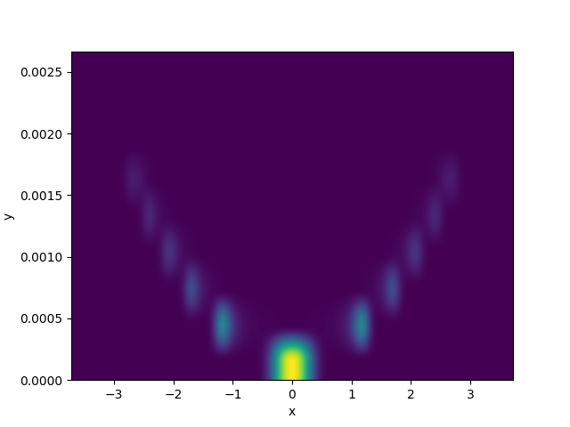
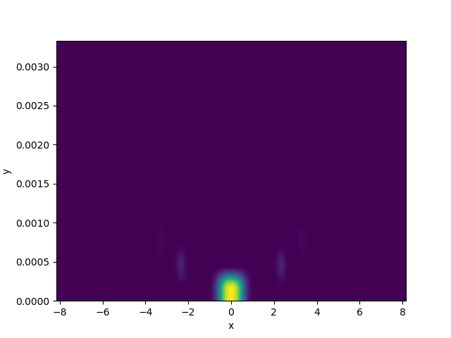

# image-convolution
Perform 2D convolution of image data

## Overview
Given two 2D datasets, this application calculates their convolution
using the [scipy.signal.convolv2d function](https://docs.scipy.org/doc/scipy/reference/generated/scipy.signal.convolve2d.html).
The datasets must be in the form:

```
<x value> <y value> <data value>
```

Example datasets are provided (`test/convolve_raw_0.dat`, `test/convolve_raw_1.dat`).

### How to get this code
Clone this code from this repository by running:

```
$ git clone https://github.com/raymenzel/image-convolution.git
$ cd image-convolution
```

### How to install and run this application
This application requires:

- python3 >= 3.8
- pip
- matplotlib
- numpy
- scipy

To install it in a virtual environment, run:

```
$ python3 -m venv env
$ source env/bin/activate # if in bash
$ pip install --upgrade pip
$ pip install .
```

An application `image-convolver` will be created.  It takes arguments:

```
$ image-convolver -h
usage: image-convolver [-h] dataset1 dataset2 output

Performs a 2D convolution of two datasets.

positional arguments:
  dataset1    A dataset.
  dataset2    Another dataset.
  output      Path to the output png file.

optional arguments:
  -h, --help  show this help message and exit
```

Running the application on the two provided test datasets:

```
$ image-convolver test/convolve_raw_0.dat test/convolve_raw_1.dat out.png
```

should produce `test/convolve_raw_0.dat.png`, `test/convolve_raw_1.dat.png`,
and `out.png`:







